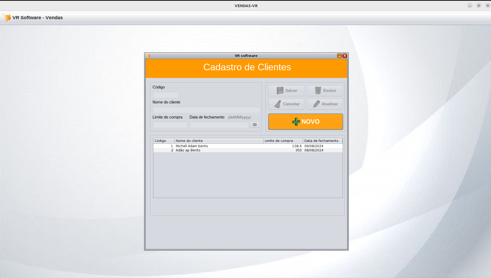
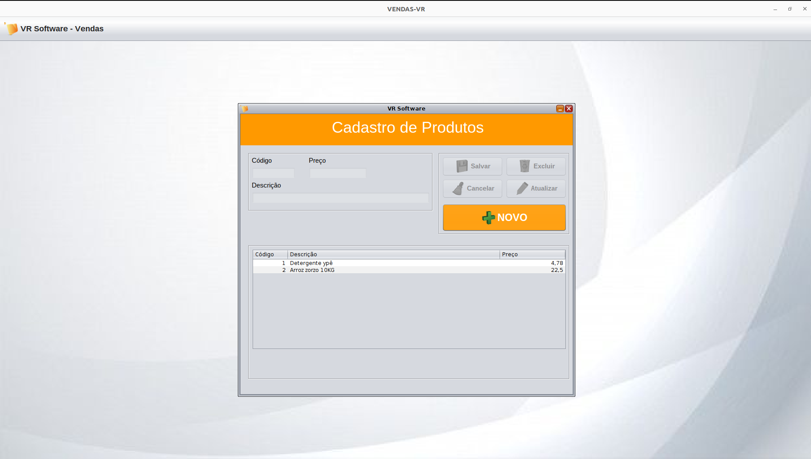
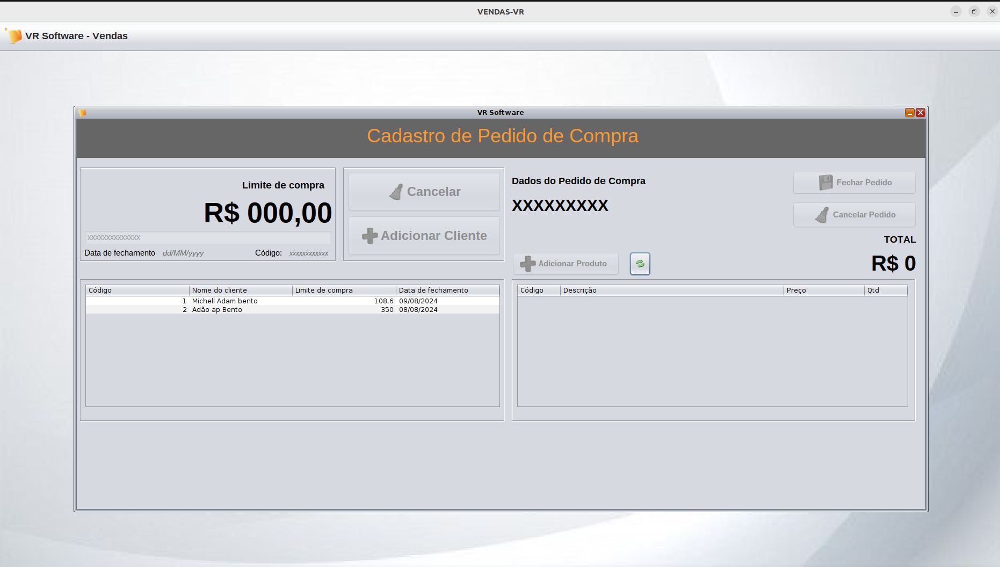

# Documentação da Aplicação

## Tela Cadastro de Cliente

Abaixo está uma captura de tela de cliente da aplicação:

## Tela Cadastro Produto

Veja como a tela de cadastro de produtos da aplicação se parece:

## Tela Cadastro Pedido de Compra

Veja como a tela de cadastro de pedido de compra da aplicação se parece:

## Instruções

1. Baixar o Projeto do cliente na seguinte [URL JAVASWING](https://github.com/michelladambento/Vendas-VR)
